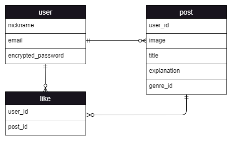
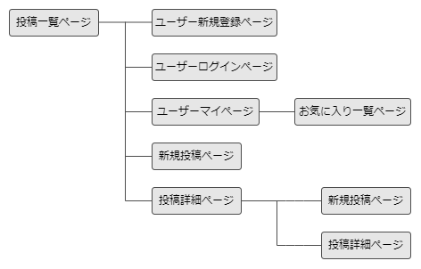

# アプリケーション名  
oshikatsu-n46  
# アプリケーション概要  
ユーザー登録をすると乃木坂46の聖地（広義、ロケ地やファッションアイテムなど）を投稿できるようになります。また、他のユーザーの投稿をお気に入り登録し、一覧を見ることができます。  
# URL  
http://00.00.000.000  
# テスト用アカウント  
- Basic認証パスワード：xxxx  
- Basic認証ID：xxxx  
- メールアドレス：xx@xxx.com  
- パスワード：xxxxxx  
# 利用方法  
## 聖地投稿  
1. トップページ（一覧ページ）のヘッダーからユーザー新規登録を行う  
2. 新規投稿ボタンから、聖地（広義）の内容（タイトル・詳細（参考URL、価格、ブランドなど）・カテゴリ・画像）を入力し投稿する  
## お気に入り管理  
1. お気に入りボタンを押すとお気に入り登録ができる  
2. マイページから自身のお気に入り一覧が見れる  
# アプリケーションを作成した背景  
ロケ地、食事、メンバーに関することなど、オタクは真似したくなってしまうもの（自分がそう）。  
聖地などがまとめられているブログや、ファッションなどをまとめてくれるXアカウントなどはあるが、それらは個人の努力でできている。  
⇒その個人の負担が大きかったり、投稿をやめてしまったら更新が止まってしまったりする。  
ロケ地、ファッション、飲食店などを網羅されているサイトがない。  
⇒調べるだるさがある。  
これらの課題を解決したいと思った。  
# 洗い出した要件  
[要件を定義したシート](https://docs.google.com/spreadsheets/d/1YPJH_mKbDqInJ5QEZMJgBeim9H57B_RP6tsm-uOcIkU/edit#gid=982722306)  
# 実装した機能についての画像  
～～画像やGIF、説明を記載～～  
# 実装予定の機能  
余裕があれば、検索機能やUI意識  
# データベース設計  

# 画面遷移図  

# 開発環境  
- フロントエンド：HTML/CSS/JavaScript  
- バックエンド：Ruby  
- テキストエディタ：Visual Studio Code  
- タスク管理：GitHub  
# ローカルでの動作方法  
以下のコマンドを順に実行。  
% git clone https://github.com/xxxxxx  
% cd xxxxxx  
% bundle install  
# 工夫したポイント  
～～企業へPRしたい事柄を記載～～  
# 改善点  
# 制作時間  